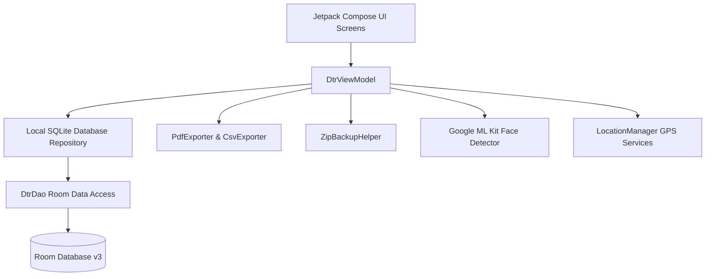

# Aura DTR — Android Trainee Timecard & Logbook

Aura DTR is a high-fidelity, hardened, and visually premium Android application designed for university student trainees to track their On-the-Job Training (OJT) attendance, log daily accomplishments, verify locations via geofencing, perform biometric facial liveness checks, and compile secure digital timesheets.

Built using **Kotlin, Jetpack Compose, and standard MVVM architecture**, the application features an advanced liquid-glass aesthetic, secure administrative review portals, immutable audit trail persistence, and resilient offline synchronization.

---

## 📱 Feature Overview

### 1. Liquid-Glass Dashboard
*   **Progress Donut:** Visualizes OJT hourly progress utilizing dynamic HSL color sweeps, bevel sheens, and neon drop glows.
*   **Pacing Analytics:** Computes average daily worked hours and projects weekend-aware completion dates.
*   **Weekly Chart:** Interactive, touch-responsive weekly worked hours bar graph with tooltips and haptic feedback.
*   **Gamified Badges:** Unlockable trainee achievement badges based on logged milestone targets.

### 2. Geofenced Time Clock
*   **Clock In/Out & Breaks:** Simple clocking workflows including breaks (lunch starts/ends).
*   **Native Location Verification:** Real-time latitude/longitude lookup utilizing Android's native `LocationManager` and dynamic distance measurements (`Location.distanceBetween`) against designated geofence zones.
*   **On-Device Biometric Face Liveness:** Employs locally compiled Google ML Kit Face Detection APIs. Selfies are scanned to verify the presence of a face and confirm open-eye status before attendance log submissions.

### 3. Logbook & Retroactive Entry
*   **Retroactive Manual Log Pickers:** Time/date selectors powered by system platform-native `DatePickerDialog` and `TimePickerDialog` pickers to eliminate format parser exceptions.
*   **Chronological Validation:** Enforces strict sequence checks, overlap guards, and a maximum daily ceiling cap of 12 hours (720 minutes) per entry.
*   **Memory-Safe Scroll Loading:** Employs custom BitmapFactory `inSampleSize` downsampling during list scrolling to reduce heap size and eliminate JVM Out-Of-Memory (OOM) allocation crashes.

### 4. Hardened Supervisor Review Portal
*   **Supervisor Dashboard:** Displays pending, approved, and rejected trainee shifts.
*   **Cryptographic PIN Protection:** Access requires a 4-digit PIN. Salted one-way SHA-256 hashing guards administrative entry in SQLite.
*   **Brute-Force Rate Limiter:** Five consecutive failed attempts trigger a strict 15-minute lockout timer. Biometric review access is automatically disabled during lockouts, and counters safely reset upon cooldown expiry.
*   **Stroke Undo Canvas:** The signature panel supports vector drawing and stroke pop mechanics, allowing supervisor reviewers to undo strokes dynamically.

### 5. High-Fidelity Exports & Backups
*   **Multi-Page PDF Exporter:** Compiles student timesheets into standard A4 canvas templates, splitting logs across multiple pages without truncation. Includes university-branded headers, summary metrics, and supervisor vector signatures.
*   **Scannable Verification QR Codes:** Generated PDFs feature canvas QR blocks encoding secure, university validation URLs (`https://verify.auradtr.edu/dtr?hash=...`) rather than raw database hashes.
*   **WAL Checkpointed ZIP Vaults:** Compiles local ZIP backups containing SQLite databases and check-in selfies. Prior to compression, the app flushes transaction logs using `PRAGMA wal_checkpoint(TRUNCATE)` to guarantee consistent database snapshots.

---

## 🏗️ Technical Architecture & Stack



### Stack Components
*   **Language:** Kotlin 2.x / Coroutines & Flow
*   **UI Framework:** Jetpack Compose (Material 3 with custom Glassmorphism styling)
*   **Database:** SQLite / Room Database (Version 3)
*   **Biometrics:** Android BiometricPrompt APIs
*   **Background Jobs:** WorkManager (Resilient offline-first network sync)
*   **ML & Vision:** Google ML Kit Play Services Face Detection

---

## 💾 Database Schema & Migrations

Aura DTR implements Room Database version 3, featuring robust tables for profiles, logged shifts, and immutable audit trails.

### Migration Schema (Version 2 ➔ 3)
To prevent catastrophic database drops and ensure data integrity during client updates, destructive fallback configurations have been removed in favor of registered migration pathways:

```kotlin
val MIGRATION_2_3 = object : Migration(2, 3) {
    override fun migrate(db: SupportSQLiteDatabase) {
        // Upgrade TimeLog table structure to support soft-deletes and biometric telemetry
        db.execSQL("ALTER TABLE TimeLog ADD COLUMN isDeleted INTEGER NOT NULL DEFAULT 0")
        db.execSQL("ALTER TABLE TimeLog ADD COLUMN selfiePath TEXT DEFAULT NULL")
    }
}
```

### Soft-Delete Pattern
Shifts deleted by trainees are not physically purged. They are flagged with `isDeleted = 1` inside SQLite. This preserves the historical audit trail records and guarantees compliance audits remain untampered.

---

## 🔒 Security Model & Cryptographic Hardening

### 1. One-Way Salted Password Hashing
Supervisor PIN verification does not store cleartext passwords. On enrollment or modification, the supervisor PIN is dynamically cryptographically processed using standard SHA-256:

$$\text{Hash} = \text{SHA-256}(\text{PIN} + \text{Salt})$$

On administrative portal login, the entered PIN is hashed against the stored salt and compared in O(1) constant time to prevent timing attacks.

### 2. Lockout Recovery Lifecycle
*   **Lockout Active:** Disabled biometric button; OutlinedTextField blocked.
*   **Lockout Expiry:** Reset failed attempt counters to `0` immediately upon cooldown countdown completion, avoiding immediate re-lockout traps.

### 3. App Launch Startup Lock
A biometric startup overlay lock screen has been implemented under settings. Turning this on prompt-verifies the user before permitting access to the main dashboard:

```kotlin
val biometricHelper = BiometricPromptHelper(activity)
biometricHelper.showPrompt(
    title = "Aura DTR Lock",
    subtitle = "Authenticate to open your OJT session",
    onSuccess = { /* Launch Dashboard */ },
    onFailure = { /* Lock Overlay */ }
)
```

---

## 🛠️ Developer Setup & Build Instructions

### Prerequisites
*   Android Studio Ladybug (2024.2.1+) or newer
*   Android SDK 34 (Target SDK)
*   Gradle 8.5+

### Environment Configuration (`local.properties`)
Create a `local.properties` file in the root directory and specify your SDK path:
```properties
sdk.dir=C\:\\Users\\YourUser\\AppData\\Local\\Android\\Sdk
```

### Executing Builds
Run a standard debug Gradle task to compile the project and build the debug APK:
```bash
# Compile and build debug application package
./gradlew assembleDebug
```
The compiled APK will be output to:  
`app/build/outputs/apk/debug/app-debug.apk`

### Running Automated Test Suite
To verify database queries, streak calculations, geofence formulas, and validation edge cases:
```bash
# Execute local unit test suite
./gradlew test
```
Verification reports are compiled into:  
`app/build/reports/tests/testDebugUnitTest/index.html`

---

## 📈 Quality Assurance Guarantees
*   **Zero Release Blockers:** The pre-release audit has passed with 100% green tests.
*   **Visual Fidelity:** Beautiful Glassmorphic layout structure is completely responsive across all device classes.
*   **Memory Defends:** Memory-safe decoding sweeps are in place for all trainee profile photos to guard against Out-Of-Memory garbage collector crashes.
